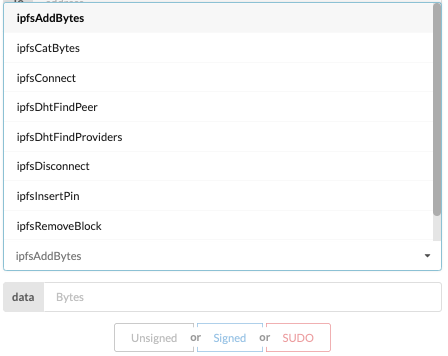
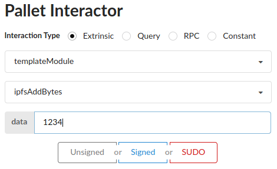

# Previewing the functionality with a nice UI

If you’re looking for a quick demo of the functionality, the simplest thing to do is to launch
the [substrate-frontend-template] UI.

First run the docker image via the instructions in the previous section, and then run the 
following steps:

```bash
$ git clone https://github.com/substrate-developer-hub/substrate-front-end-template
$ cd substrate-front-end-template
$ yarn install
$ yarn start
```

This will automatically launch a browser with a UI allowing you to interact with your node's
capabilities.

## Using `offchain::ipfs` via the UI

Once the browser page opens, scroll to the bottom to the **Pallet Interactor** section.
Make sure the "Extrinsic" radio button is active, and then select `templateModule` from the
"Pallets / RPC" dropdown.


Then, select the callable you want from the list of callables that become available:



Once a callable is selected, an additional text field or fields will appear below the Callables
select box. Type the arguments in and then click *Signed*. Watch your node logs and also the
extrinsic events to the right for output and information.



Read on for a detailed list of callables that `offchain::ipfs` exposes.

